# Architecture

## Overview

```mermaid
flowchart TB
    subgraph LLM["Dev / LLM agent (Claude Code, Codex)"]
        CLI[urbex CLI]
    end

    subgraph AppRepo["App repo (GitHub/GitLab/Gitea)"]
        Manifest[urbex.yaml]
        Code[App code]
    end

    subgraph GitOpsRepo["GitOps repo (on Gitea)"]
        TF[Terraform/OpenTofu]
        ANS[Ansible]
        SEC[Encrypted secrets - SOPS+age]
    end

    subgraph Proxmox["Proxmox server"]
        subgraph Base["Base services LXCs"]
            Gitea
            Komodo
            Technitium[Technitium DNS]
            Keycloak
            Prom[Prometheus + Grafana + Loki]
        end
        subgraph Staging["Per-project LXC - staging"]
            SvcS[docker compose service]
        end
        subgraph Prod["Per-project LXC - production"]
            SvcP[docker compose service]
        end
    end

    subgraph Edge["Public ingress"]
        CF[Cloudflare Tunnel]
    end

    subgraph Frontend["Frontend"]
        Pages[Cloudflare Pages - web]
        FB[Firebase - mobile]
    end

    CLI -->|reads/writes| Manifest
    CLI -->|bootstrap / plan / apply| TF
    CLI -->|deploy / promote| Komodo
    TF -->|provisions| Base
    TF -->|provisions| Staging
    TF -->|provisions| Prod
    ANS -->|configures| Base
    ANS -->|configures| Staging
    ANS -->|configures| Prod
    Gitea -->|GitOps repo + app repo| GitOpsRepo
    Komodo -->|poll/webhook + redeploy| SvcS
    Komodo -->|poll/webhook + redeploy| SvcP
    Technitium -->|resolves internal names| Base
    Technitium -->|resolves internal names| Staging
    Technitium -->|resolves internal names| Prod
    Keycloak -->|SSO| Base
    Keycloak -->|OIDC + roles| SvcS
    Keycloak -->|OIDC + roles| SvcP
    CF -->|routes without exposed ports| Staging
    CF -->|routes without exposed ports| Prod
    Code -->|build| Pages
    Code -->|build| FB
```

## Components

### urbex CLI

The project's main interface (see
[ADR-0001](decisions/0001-cli-first-interface.md)). Portable: works with
any agent that has shell access (Claude Code, Codex, or a human). Main
commands (draft, to be refined during technical design):

| Command | Purpose |
|---|---|
| `urbex bootstrap` | Provisions the base services on a fresh Proxmox (Gitea, Komodo, Technitium, Keycloak, Prometheus/Grafana/Loki) and initializes the GitOps repo. See [ADR-0006](decisions/0006-bootstrap-command.md). |
| `urbex init` | Generates/validates `urbex.yaml` in the app repo, typically run by the LLM after analyzing the project code. |
| `urbex plan <env>` | Computes the infrastructure changes needed (Terraform diff + Ansible config) for an environment, without applying them. |
| `urbex apply <env>` | Applies the planned changes: creates/updates LXCs, registers DNS, configures reverse-ingress, registers the service with Keycloak/Grafana. |
| `urbex deploy <env>` | Triggers the application deploy (docker compose update) via Komodo. |
| `urbex promote` | Promotes a release from staging to production (Git tag/release). |
| `urbex status` | Current status of a project/environment (LXCs, DNS, certificates, latest release). |
| `urbex destroy <env>` | Removes an environment's infrastructure. |

### App manifest (`urbex.yaml`)

Lives in the app repo, not in the GitOps repo: it declares what the app
needs, maintained by the same LLM that writes the app's code. See
[ADR-0002](decisions/0002-app-manifest-in-app-repo.md) and the full schema
in [`manifest-spec.md`](manifest-spec.md).

### Provisioning: Terraform/OpenTofu + Ansible

Terraform/OpenTofu creates/destroys LXCs on Proxmox (resources, network,
storage) with tracked state; Ansible configures the inside of the LXCs
(Docker, users, hardening, joining Technitium/Keycloak). See
[ADR-0003](decisions/0003-terraform-ansible-provisioning.md).

### GitOps: repo on Gitea + Komodo

All infrastructure (Terraform definitions, Ansible playbooks, encrypted
secrets, base service manifests) is versioned in a GitOps repo hosted on a
self-hosted Gitea instance on the same Proxmox. Komodo watches the repos
(poll/webhook) and applies updates to the docker compose files on the
LXCs, acting as the system's reconciliation engine. See
[ADR-0004](decisions/0004-gitops-gitea-komodo.md).

### Ingress: Cloudflare Tunnel

No ports are publicly exposed on the Proxmox server: traffic to
staging/prod goes through a Cloudflare tunnel to the internal LXCs.
Consistent with using Cloudflare Pages for the web frontend. See
[ADR-0005](decisions/0005-cloudflare-tunnel-ingress.md).

### Internal DNS: Technitium

A dedicated LXC running Technitium DNS resolves names between services on
the Proxmox network (e.g. `api.staging.<project>.internal`). The public
domain used for exposed endpoints is **configurable per deployment**, not
hardcoded in the Urbex project. See
[ADR-0007](decisions/0007-technitium-configurable-domain.md).

### Identity: Keycloak

A single Keycloak, three uses:

1. SSO for admin UIs (Komodo, Grafana, Gitea, Technitium).
2. OIDC provider for dev apps (apps register as clients).
3. Service APIs are protected by roles defined in Keycloak.

See [ADR-0008](decisions/0008-keycloak-scope.md).

### Observability: Prometheus + Grafana (+ Loki)

Prometheus/Grafana cover the explicitly requested metrics. The original
request also mentions "logging": the natural complement in the Grafana
stack is **Loki + Promtail**, added as a design assumption — to be
confirmed during technical detailing (see
[ADR-0004](decisions/0004-gitops-gitea-komodo.md#logging-note), Open
Questions section).

### Environment topology

One LXC per service per environment (staging and production are always
isolated on separate LXCs). See
[ADR-0009](decisions/0009-one-lxc-per-service-per-env.md).

### Staging → production promotion

Push to the app repo's main branch → automatic deploy to staging. Git tag
or release → Komodo applies the redeploy to the production LXC. See
[ADR-0010](decisions/0010-promotion-flow.md).

### Secrets

SOPS + age to encrypt secrets committed to the GitOps repo in v1; optional
HashiCorp Vault support planned for v2+. See
[ADR-0011](decisions/0011-secrets-sops-age.md).

## Bootstrap vs steady-state

Urbex operates in two distinct modes, to solve the chicken-and-egg problem
(the GitOps repo that is supposed to manage Gitea cannot exist before
Gitea exists):

1. **Bootstrap** (`urbex bootstrap`): runs Terraform+Ansible directly
   against the Proxmox API to create the base services and the first
   Gitea repo, then pushes the initial state to it as the GitOps repo.
2. **Steady-state**: from that point on, every change (new project, new
   environment, base service update) goes through a commit to the GitOps
   repo + reconciliation via Komodo/CLI.

See [ADR-0006](decisions/0006-bootstrap-command.md).
