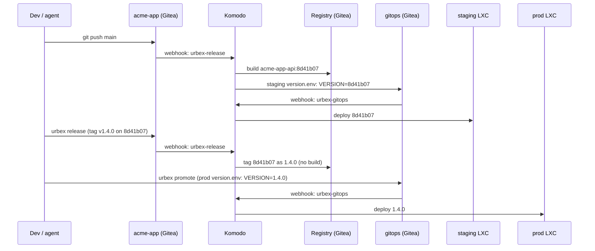

# Architecture

## Overview

```mermaid
flowchart TB
    subgraph LLM["Dev / LLM agent (Claude Code, Codex)"]
        CLI[urbex CLI]
    end

    subgraph AppRepo["App repo (on Gitea)"]
        Manifest[urbex.yaml]
        Code[App code]
    end

    subgraph GitOpsRepo["GitOps repo (on Gitea)"]
        TF[Terraform/OpenTofu]
        ANS[Ansible]
        ENVS[environments/: versions, config, SOPS secrets]
    end

    subgraph Proxmox["Proxmox server"]
        subgraph Base["Base services LXCs"]
            Gitea
            Komodo
            Technitium[Technitium DNS]
            Keycloak
            Prom[Prometheus + Grafana + Loki]
        end
        subgraph Staging["Per-project LXC - staging"]
            SvcS[service container + Periphery]
        end
        subgraph Prod["Per-project LXC - production"]
            SvcP[service container + Periphery]
        end
    end

    subgraph Edge["Public ingress"]
        CF[Cloudflare Tunnel]
    end

    subgraph Frontend["Frontend"]
        Pages[Cloudflare Pages - web]
        FB[Firebase - mobile]
    end

    CLI -->|reads/writes| Manifest
    CLI -->|bootstrap / plan / apply| TF
    CLI -->|declares builds, stacks, webhooks| Komodo
    Code -->|push to main, tag vX.Y.Z: webhook| Komodo
    Komodo -->|sets staging to each build of main| ENVS
    ENVS -->|push: webhook| Komodo
    TF -->|provisions| Base
    TF -->|provisions| Staging
    TF -->|provisions| Prod
    ANS -->|configures| Base
    ANS -->|configures| Staging
    ANS -->|configures| Prod
    Gitea -->|GitOps repo + app repo| GitOpsRepo
    Komodo -->|deploys environments/staging| SvcS
    Komodo -->|deploys environments/prod| SvcP
    Technitium -->|resolves internal names| Base
    Technitium -->|resolves internal names| Staging
    Technitium -->|resolves internal names| Prod
    Keycloak -->|SSO| Base
    Keycloak -->|OIDC + roles| SvcS
    Keycloak -->|OIDC + roles| SvcP
    CF -->|routes without exposed ports| Staging
    CF -->|routes without exposed ports| Prod
    Code -->|build| Pages
    Code -->|build| FB
```

## Components

### urbex CLI

The project's main interface (see
[ADR-0001](decisions/0001-cli-first-interface.md)). Portable: works with
any agent that has shell access (Claude Code, Codex, or a human). Every
command and flag is in the [CLI reference](reference/cli.md).

| Command | Purpose |
|---|---|
| `urbex bootstrap` | Provisions the base services on a fresh Proxmox (Gitea, Komodo, Technitium, Keycloak, Prometheus/Grafana/Loki) and initializes the GitOps repo. See [ADR-0006](decisions/0006-bootstrap-command.md). |
| `urbex init` | Generates/validates `urbex.yaml` in the app repo, typically run by the LLM after analyzing the project code. |
| `urbex plan <env>` | Computes the infrastructure changes needed (Terraform diff + Ansible config) for an environment, without applying them. |
| `urbex apply <env>` | Applies the planned changes: creates/updates LXCs, connects them to Komodo, declares the project's builds and the environment's folder and stacks; a new staging starts following `main`. Still to come: DNS, ingress, Keycloak/Grafana registration. |
| `urbex release` | Tags the next release on the commit staging runs; Komodo gives that commit's images the version. |
| `urbex deploy <env>` | Sets what an environment runs (a release, a commit, or "follow `main`"), in the GitOps repo; Komodo deploys it. |
| `urbex promote` | Sets production to the release staging runs. |
| `urbex secret` | Manages an environment's SOPS-encrypted secrets in the GitOps repo. |
| `urbex status` | Current status of a project/environment (LXCs, wanted and running versions; later DNS and certificates). |
| `urbex destroy <env>` | Removes an environment's infrastructure. |

### App manifest (`urbex.yaml`)

Lives in the app repo, not in the GitOps repo: it declares what the app
needs, maintained by the same LLM that writes the app's code. See
[ADR-0002](decisions/0002-app-manifest-in-app-repo.md) and the full schema
in the [manifest reference](reference/manifest.md).

### Provisioning: Terraform/OpenTofu + Ansible

Terraform/OpenTofu creates/destroys LXCs on Proxmox (resources, network,
storage) with tracked state; Ansible configures the inside of the LXCs
(Docker, the Komodo Periphery agent, later hardening and joining
Technitium/Keycloak). LXCs run Debian 13. See
[ADR-0003](decisions/0003-terraform-ansible-provisioning.md).

### GitOps: repo on Gitea + Komodo

Everything that defines the platform and what runs on it is versioned
in a GitOps repo hosted on a self-hosted Gitea instance on the same
Proxmox: the infrastructure (Terraform definitions and state, Ansible
playbooks) and, under `environments/`, one folder per environment with
each service's compose file, configuration, encrypted secrets, and the
version to deploy. App repos live on the same Gitea.

Komodo is the build and rollout engine. It builds each service's image
from the app repo on every push to `main`, pushes it to Gitea's
container registry, and deploys each environment folder of the GitOps
repo on the service's LXC, through the Periphery agent installed there,
whenever the folder changes. What Urbex creates in Gitea and Komodo is
listed in [platform resources](reference/platform-resources.md); the
repo's layout and files in the [GitOps repo reference](reference/gitops-repo.md). See
[ADR-0004](decisions/0004-gitops-gitea-komodo.md),
[ADR-0018](decisions/0018-image-build-komodo-gitea-registry.md),
[ADR-0020](decisions/0020-trunk-releases-gitops-environments.md), and
[ADR-0021](decisions/0021-staging-follows-main.md).

### Ingress: Cloudflare Tunnel

No ports are publicly exposed on the Proxmox server: traffic to
staging/prod goes through a Cloudflare tunnel to the internal LXCs.
Consistent with using Cloudflare Pages for the web frontend. See
[ADR-0005](decisions/0005-cloudflare-tunnel-ingress.md).

### Internal DNS: Technitium

A dedicated LXC running Technitium DNS resolves names between services on
the Proxmox network (e.g. `api.staging.<project>.internal`). The public
domain used for exposed endpoints is **configurable per deployment**, not
hardcoded in the Urbex project. See
[ADR-0007](decisions/0007-technitium-configurable-domain.md).

### Identity: Keycloak

A single Keycloak, three uses:

1. SSO for admin UIs (Komodo, Grafana, Gitea, Technitium).
2. OIDC provider for dev apps (apps register as clients).
3. Service APIs are protected by roles defined in Keycloak.

Each project gets its own Keycloak realm, separate from the `platform`
realm used for admin SSO. See
[ADR-0008](decisions/0008-keycloak-scope.md) and
[ADR-0014](decisions/0014-keycloak-realm-per-project.md).

### Observability: Prometheus + Grafana + Loki

Prometheus/Grafana cover the explicitly requested metrics. **Loki +
Promtail** complete the stack for the explicitly requested "logging",
running on the same base-services LXC. See
[ADR-0004](decisions/0004-gitops-gitea-komodo.md#logging-note).

### Environment topology

One LXC per service per environment (staging and production are always
isolated on separate LXCs). See
[ADR-0009](decisions/0009-one-lxc-per-service-per-env.md).

### Staging → production promotion

Project repos are developed trunk-based. Every push to `main` is built
once, into images tagged with the commit, and staging follows `main`: it
is set to each new build. A release is a tag (`vX.Y.Z`) on the commit
staging runs, which gives that commit's images the version - nothing is
rebuilt. Production runs releases. An environment runs the version
written in its folder of the GitOps repo, so following `main`,
promoting, and rolling back are all commits there - production gets the
very image staging ran.

```mermaid
sequenceDiagram
    participant Dev as Dev / agent
    participant Repo as acme-app (Gitea)
    participant K as Komodo
    participant Reg as Registry (Gitea)
    participant G as gitops (Gitea)
    participant S as staging LXC
    participant P as prod LXC
    Dev->>Repo: git push main
    Repo->>K: webhook: urbex-release
    K->>Reg: build acme-app-api:8d41b07
    K->>G: staging version.env: VERSION=8d41b07
    G->>K: webhook: urbex-gitops
    K->>S: deploy 8d41b07
    Dev->>Repo: urbex release (tag v1.4.0 on 8d41b07)
    Repo->>K: webhook: urbex-release
    K->>Reg: tag 8d41b07 as 1.4.0 (no build)
    Dev->>G: urbex promote (prod version.env: VERSION=1.4.0)
    G->>K: webhook: urbex-gitops
    K->>P: deploy 1.4.0
```

See [ADR-0020](decisions/0020-trunk-releases-gitops-environments.md) and
[ADR-0021](decisions/0021-staging-follows-main.md).

### Secrets

SOPS + age to encrypt secrets committed to the GitOps repo in v1; optional
HashiCorp Vault support planned for v2+. Each service's secrets live next
to its configuration, in its environment folder, and are decrypted only
on its LXC at deploy time. See
[ADR-0011](decisions/0011-secrets-sops-age.md).

### Platform configuration and credentials

Non-sensitive platform settings (base domain, Cloudflare zone, Proxmox
connection details, DNS/Keycloak endpoints) live in a versioned
`urbex.platform.yaml` at the root of the GitOps repo. Credentials (API
tokens, the age private key) never enter Git — they live in a local
`~/.urbex/credentials.yaml` (or environment variables) on whichever
machine runs the CLI. See
[ADR-0012](decisions/0012-platform-config-and-credentials.md).

### Transactional email

Apps declare transactional email needs (signup confirmation, password
reset, notifications) via a managed provider — **Brevo** in v1, with the
manifest designed to add more providers later without a breaking change.
The provider API key is handled as a secret (SOPS+age), never written in
the manifest. See
[ADR-0015](decisions/0015-transactional-email-brevo.md).

### Terraform state

State is kept as a local file committed to the GitOps repo, next to the
Terraform files it belongs to (`terraform/base/`,
`terraform/projects/<project>/<env>/`). Encrypting it with SOPS+age is
designed but not implemented yet: today it is plain JSON, holding no
secrets. See
[ADR-0013](decisions/0013-terraform-state-in-gitops-repo.md).

## Bootstrap vs steady-state

Urbex operates in two distinct modes, to solve the chicken-and-egg problem
(the GitOps repo that is supposed to manage Gitea cannot exist before
Gitea exists):

1. **Bootstrap** (`urbex bootstrap`): runs Terraform+Ansible directly
   against the Proxmox API to create the base services and the first
   Gitea repo, then pushes the initial state to it as the GitOps repo.
2. **Steady-state**: from that point on, every change (new project, new
   environment, base service update) goes through a commit to the GitOps
   repo + reconciliation via Komodo/CLI.

See [ADR-0006](decisions/0006-bootstrap-command.md).

The Terraform modules and Ansible playbooks for the base services are
embedded in the `urbex` CLI binary and materialized into the GitOps repo
the first time `urbex bootstrap` runs; a Proxmox pre-flight check aborts
bootstrap if a base-service hostname already exists outside of Terraform's
knowledge, instead of silently adopting or duplicating it. See
[ADR-0017](decisions/0017-embedded-base-infra-assets.md).
