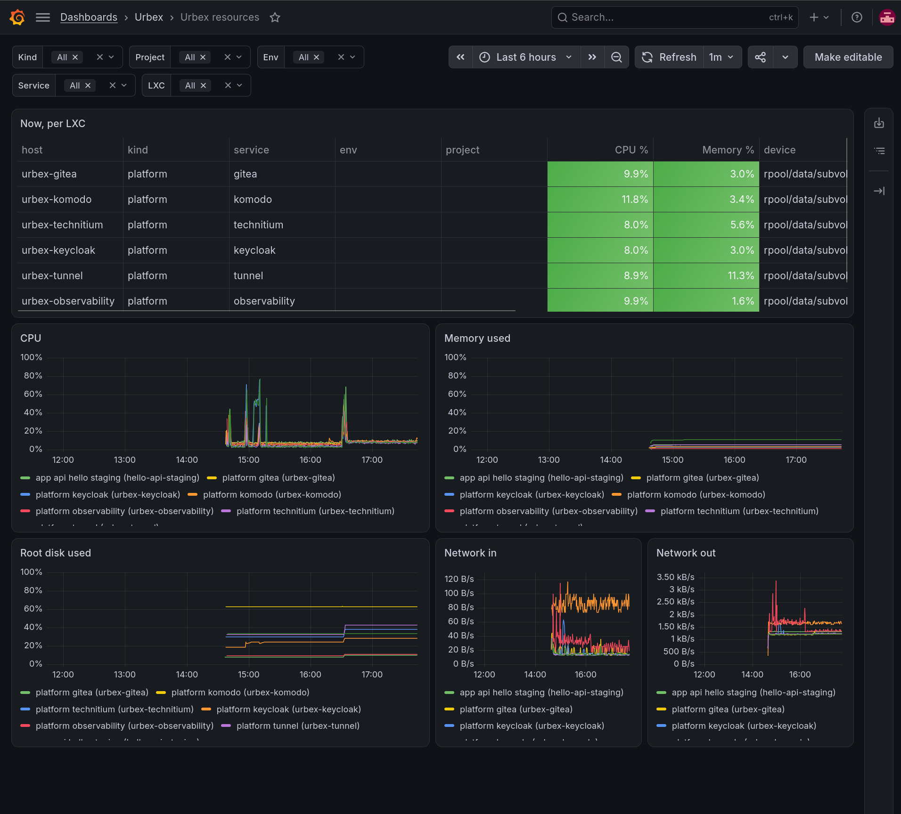

# ADR-0023: Logs and resource metrics of every LXC, by an agent on each

## Status

Accepted. Implements the logging of
[ADR-0004](0004-gitops-gitea-komodo.md#logging-note), and resource
monitoring, for the base services and the project services.
Refined by [ADR-0027](0027-service-conventions.md):
three kinds (`infra`, `app`, `support`) replace `platform` and `app`,
Periphery's and Alloy's own logs are shipped as `support`, and
resources are also collected per container.

## Context

The observability LXC has run Prometheus, Loki and Grafana since the
first bootstrap, but nothing sent them anything: a service's logs were
only on its LXC (`docker logs`) and in Komodo's UI, one service at a
time. The roadmap asks for every service's logs to reach the
observability stack automatically, with no setup in the project.

Options considered for getting container logs to Loki:

- Docker's Loki logging driver: a plugin installed on every Docker
  host; a Loki outage can block the containers writing logs.
- Promtail: end of life (folded into Grafana Alloy).
- **Grafana Alloy**, reading containers' logs through the Docker API.

## Decision

- **A Grafana Alloy agent on every LXC** - base services (installed by
  `urbex bootstrap`) and project services (by `urbex apply`) - from the
  Ansible role `telemetry`, as a container with the Docker socket,
  `/proc`, `/sys` and the root filesystem mounted read-only.
- **Logs**: the containers of the LXC's service only - the Komodo Stack's
  on a project LXC (compose project named like the LXC), the `/opt/urbex`
  compose project on a base-service LXC. Periphery's (on project LXCs)
  and the agent's own logs aren't shipped. Pushed to Loki.
- **Resource metrics**: Alloy's built-in node exporter reads the LXC's
  CPU, memory, filesystems and network; pushed to Prometheus (remote
  write) every 30 seconds.
- **Labels**, the same on logs and metrics:

  | Label | Platform | App |
  |---|---|---|
  | `kind` | `platform` | `app` |
  | `service` | `gitea`, `komodo`, `keycloak`, `technitium`, `observability`, `tunnel` | the manifest's service |
  | `project`, `env` | - | the project, `staging`/`prod` |
  | `host` | the LXC | the LXC |
  | `container` (logs) | the container | the container |

- **Keycloak logs what matters**: every HTTP request (access log) and
  user events - logins, failed logins - at INFO; otherwise it writes
  nothing after starting.
- **Komodo shows the same split**: the base services' LXCs run Komodo's
  Periphery too (so Komodo monitors their containers), and Komodo's
  resources carry the same tags - `platform` on the base services'
  Servers, the builder and urbex's Action and Procedure; `app`, the
  project and the environment on a project's Servers and Stacks (`app`
  and the project on its Builds).
- **Logs on by default**; `observability.logs: false` in `urbex.yaml`
  stops shipping a project's logs. Resource metrics are always collected.
- **Grafana is provisioned** with Loki and Prometheus as data sources and
  two dashboards (folder *Urbex*): *Urbex logs* (kind, project,
  environment, service, search) and *Urbex resources* (CPU, memory, disk
  and network per LXC, with the same filters, and a table of current
  values).
- Images pinned: Loki 3.7.8, Grafana 13.2.3, Prometheus v3.15.0,
  Alloy v1.20.1, Keycloak 26.7.5 (from 26.0, for its access log; its
  development database keeps the credentials 26.0 created it with). The smallest LXCs grow to fit the agent: Technitium
  1 GiB, the tunnel's 512 MiB.

*The Urbex resources dashboard on the test platform: platform and app
LXCs side by side, told apart by `kind`.*

## Rationale

- Reading through the Docker API needs nothing from the services: no
  logging driver, no change to the compose files, logs stay readable
  with `docker logs` and in Komodo.
- An agent per LXC keeps the labels exact: the LXC knows which project,
  service and environment it runs, or which base service.
- Pushing (remote write) rather than having Prometheus scrape the LXCs
  means no list of targets to keep in sync as LXCs come and go.
- If Loki is down, Alloy buffers and retries; the services are not
  affected.

## Consequences

- Every LXC runs one more small container (~100 MiB).
- Loki keeps logs with its default single-node configuration (local
  filesystem, no retention limit set): disk usage on the observability
  LXC grows with the logs. Retention is a follow-up.
- Not covered yet: the services' own metrics (`observability.metrics`),
  per-container resource usage, alerting, web frontends (Cloudflare
  Workers - their logs are on Cloudflare).
- CPU usage is computed from the busy time (user, system, ...) divided by
  the LXC's CPUs: inside an LXC, `/proc/stat` is virtualized by lxcfs and
  its idle counter undercounts, so `1 - idle` reads 60-80% busy on
  nearly idle LXCs.
- Filtering the containers is done at discovery: Alloy's `relabel_rules`
  on `loki.source.docker` didn't drop the other containers' logs.
